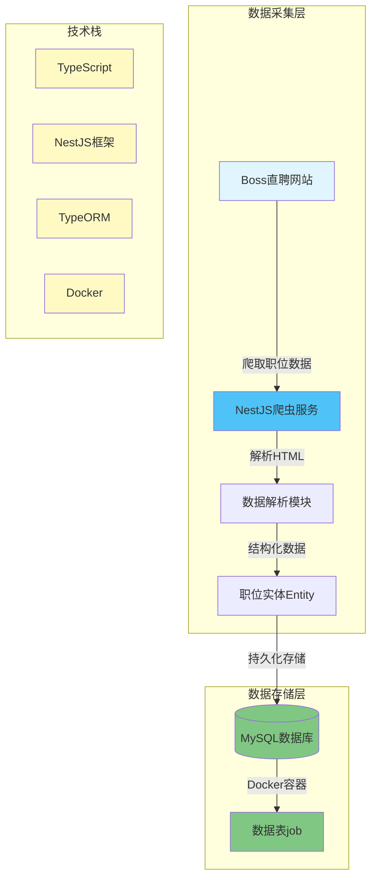
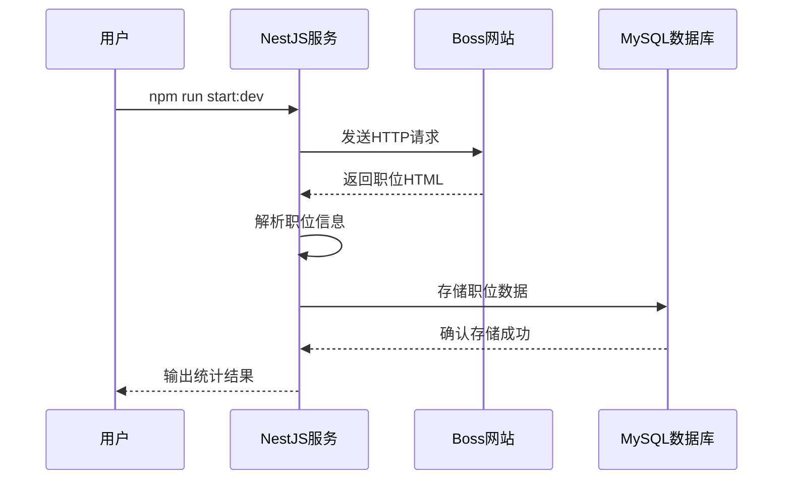

# boss_job_count
boss网站爬虫，查看java岗位数量

## 项目架构

## 测试流程

## 快速开始

npm install

npm run start:dev

数据库使用的docker容器，需要先配置连接

sql文件如下：

-- auto-generated definition
create table job
(
    id      int auto_increment
        primary key,
    name    varchar(30)  not null comment '职位名称',
    area    varchar(20)  not null comment '区域',
    salary  varchar(10)  not null comment '薪资范围',
    link    varchar(600) not null comment '详情页链接',
    company varchar(30)  not null comment '公司名',
    `desc`  text         not null comment '职位描述'
);

